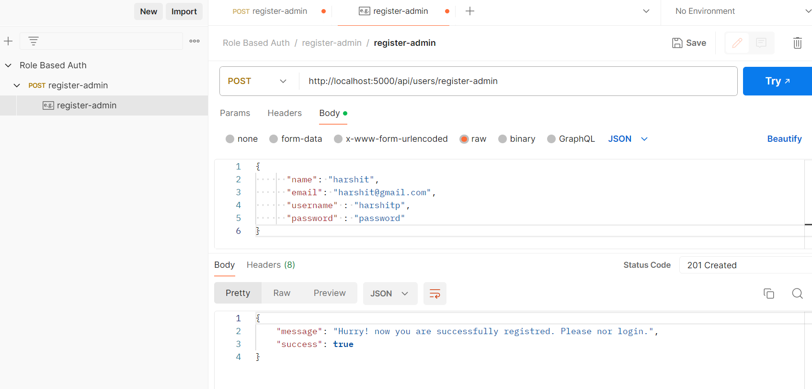
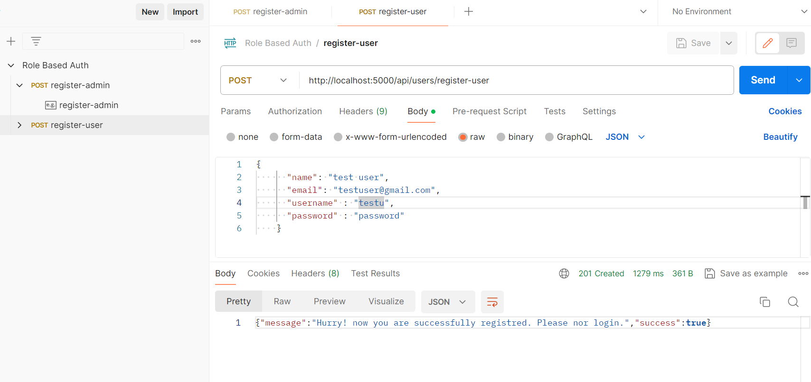
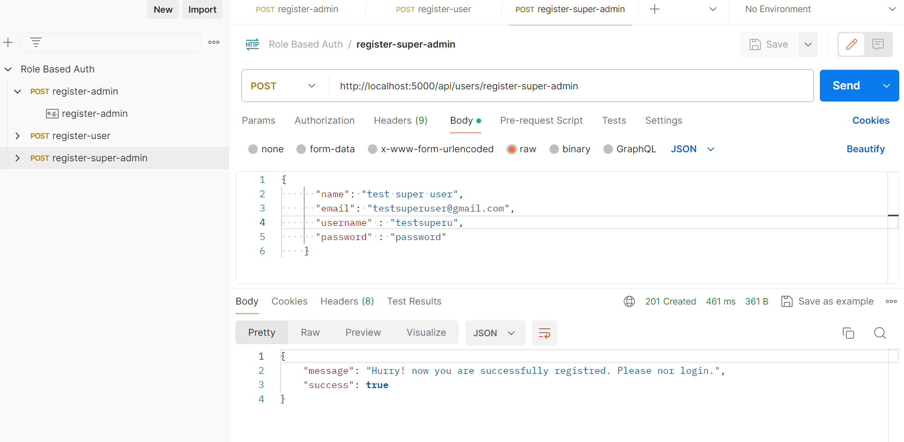
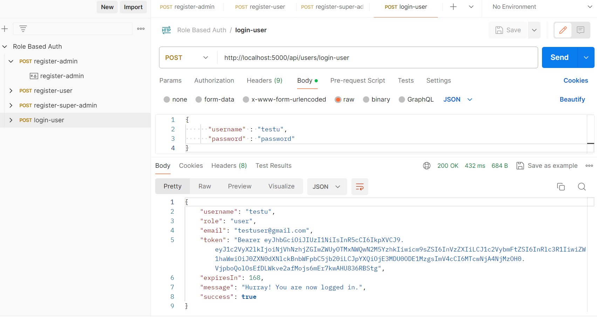
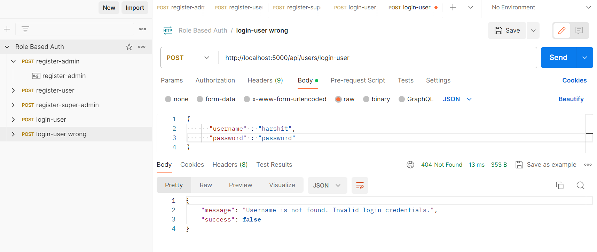

## Role Based Access Control 

### Install

``` git clone https://github.com/harshit-paneri/role-based-auth.git ```

``` cd role-based-auth ```

``` npm install ```

``` npm start ```

 ### All Endpoints

 - Register Admin
  ``/api/users/register-admin``

  

- Register User
  ``/api/users/register-user``

  

- Register Super User
  ``/api/users/register-super-user``
  

- Login User
  ``/api/users/login-user``

  
  
  - Bad Request

  
